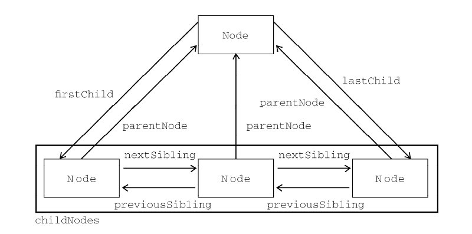

# DOM节点层次

> DOM 可以将任何 HTML 或 XML 文档描绘成一个由多层节点构成的结构。
+ 节点分为几种不同的类型，每种类型分别表示文档中不同的信息及（或）标记。
+ 每个节点都拥有各自的特点、数据和方法
+ 其他节点存在某种关系，构成节点层次关系（树形节点）


```
<html>
<head>
<meta http-equiv="Content-Type" content="text/html; charset=utf-8" /> 
	<title>无标题</title>
</head>
<body>
</body>
</html>

```

可以将这个简单的 HTML 文档表示为一个层次结构，解析：
+ 文档节点是每个文档的根节点，即：可以把这个HTML文件看成文档节点
+ 文档元素：文档节点的子元素，即：html节点

***在 HTML 页面中，文档元素始终都是<html>元素。在 XML 中，没有预定义的元素，因此任何元素都可能成为文档元素***


> 每一段标记都可以通过树中的一个节点来表示：
+ 元素节点：HTML元素
+ 特性节点：特性
+ 文档类型节点：文档类型
+ 注释节点：注释
+ …………………………………………………………，总共12中节点类型


##1. Node类型

> DOM1 级定义了一个 Node 接口，该接口将由 DOM 中的所有节点类型实现。这个 Node 接口在JavaScript 中是作为 Node 类型实现的；JavaScript 中的所有节点类型都继承自 Node 类型，因此所有节点类型都共享着相同的基本属性和方法


	每个节点都有一个 nodeType 属性，用于表明节点的类型
+    Node.ELEMENT_NODE(1)；
+  Node.ATTRIBUTE_NODE(2)；
+  Node.TEXT_NODE(3)；
+  Node.CDATA_SECTION_NODE(4)；
+  Node.ENTITY_REFERENCE_NODE(5)；
+  Node.ENTITY_NODE(6)；
+  Node.PROCESSING_INSTRUCTION_NODE(7)；
+  Node.COMMENT_NODE(8)；
+  Node.DOCUMENT_NODE(9)；
+  Node.DOCUMENT_TYPE_NODE(10)；
+  Node.DOCUMENT_FRAGMENT_NODE(11)；
+  Node.NOTATION_NODE(12)
**IE 没有公开 Node 类型的构造函数，不存在上述常亮，因此直接使用常亮IE中会报错**


###1.1 NodeName和NodeValue属性

> 要了解节点的具体信息，可以使用NodeName或NodeValue属性，它们的属性值**完全**取决于节点类型，使用前最好先检测一下节点类型。

```javascript
if(someNode.nodeType == 1){
	value = someNode.nodeName;			//nodeName是元素标签的标签名
}

```

###1.2 节点关系

> 节点关系可以用传统的家族关系来描述，相当于把文档比喻成家谱。而所有节点均可能有如下关系特性：
+ childNodes---子节点，保存的所有子节点-NodeList类型，类数组
+ hasChildNodes
+ firstChild--previousSibling为null的节点
+ lastChild---nextSibling为null的节点
+ previousSibling
+ nextSibling
+ parentNode
+ ownerDocument--所属文档节点，任何一个节点有且只有一个，构成一个文档树结构




NodeList类型：类数组对象，保存一组有序的节点【非Array实例】。**它的独特之处在于，它是基于DOM结构动态执行查询的结果，因此DOM结构的变化会自动反应到NodeList对象中**
+ 非某个瞬间的拍摄下来的快照
+ 可以说是有呼吸，有生命的对象

```javascript
var firstChild = someNode.childNodes[0];
var lastChild  = someNode.childNodes[someNode.length - 1];
var count = someNode.childNodes.length;
var secondChild = someNode.childNodes.item(1);

```


#### 兼容IE8以下转换Array对象

```javascript
function convertToArray(nodelist){
	try{
		return Array.prototype.slice(nodelist,0);		//非IE6~IE8
	}catch(e){	//IE6~IE8
		var arr = [];
		for(var i=0,len=nodelist.length;i<len;i++){
			arr.push(nodelist[i]);
		}
		return arr;
	}
}

```

###1.3 节点操作

> 


