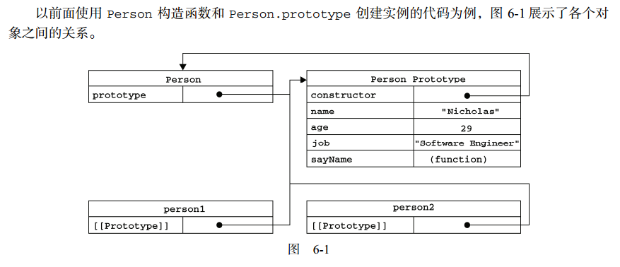

# 创建对象

> 虽然Object构造函数或对象字面量都可以用来创建单个对象，但这些方式有个明显的缺点：使用同一个借口创建很多对象，会产生大量的重复代码。

##1. 工厂模式

> 是一种广为人知的设计模式，这种模式抽象了创建具体对象的过程。

```javascript
function createPerson(name, age, job){
  var o = new Object();
  o.name = name;
  o.age = age;
  o.job = job;
  o.sayName = function(){
    console.log(this.name);
  };
  return o;
}

var p1 = createPerson('Nick', 32, 'software Engineer');
var p2 = createPerson('reds', 23, 'doctor');

```

***这种创建对象的方法虽然解决了创建多个相似对象的问题，但切没有解决对象识别的问题***

##2. 构造函数模式

> ECMAScript中的构造函数可以用来创建特定类型的对象，例如：Object和Array这样的构造函数，在运行时会自动出现在执行环境中。

```javascript
function Person(name, age, job){
  this.name = name;
  this.age = age;
  this.job = job;
  this.sayName =function(){
    console.log(this.name);
  }
}

var p = new Person('linq', 23, 'Programer');

```

**函数名Person中的P采用大写，按照惯例，构造函数始终都应该以一个大写字母开头，而非构造函数则应该以小写字母开头**

较之工厂模式创建有一下不同特定：
+ 没有显式的创建对象
+ 直接将属性和方法赋值给了this对象；
+ 没有return语句


***创建Person的新实例，必须使用new操作符。这种方式构造函数实际上会经历一下4个步骤：***
+ 创建一个新对象
+ 将新对象作为构造函数的作用域（因此this就指向了这个新对象）
+ 执行构造函数中的代码（为这个新对象添加属性）
+ 返回新对象

```javascript
console.log(p1.constructor == Person);
console.log(p2.constructor == Person);

console.log(p2 instanceof Object); //true
console.log(p1 instanceof Person); //true

```

***创建自定义构造函数意味着将来可以将它的实例标识为一种特定的类型***


###2.1 将构造函数当做函数

> 构造函数和其它函数的唯一区别，就在于调用它们的方式不同。
+ 任何函数只要通过new操作符来调用，那么它就是作为构造函数
+ 任何函数如果不过通过new操作符来调用，那么它就和普通函数也不会有什么两样。

```javascript
var p2 = new Person('linq', 32, 'Programer');
p2.sayName();   // linq

Person('Greg', 27, 'Doctor');   //当前执行环境this为window
window.sayName();           //"Greg"

//在另一个对象的作用域中调用
var o = new Object();
Person.call(o, 'Kristen', 25, 'Nurse');
o.sayName();

```

###2.2 构造函数的问题

> 构造函数模式虽然好用，但每个实例的方法都要在实例上创建一遍。但创建两个完成同样任务的Function实例的确没有必要

```javascript
function Person(name, age, job){
  this.name = name;
  this.age = age;
  this.job = job;
  this.sayName = sayName;
}

function sayName(){
  console.log(this.name);
}

var p1 = new Person('Nicholas', 23, 'Software Engineer');
var p2 = new Person('Greg', 27, 'Doctor');

```

##3. 原型模式

> 创建的每一个函数都有一个prototype（原型）属性，这个属性是一个指针，指向一个对象，而这个对象的用途是包含可以由特定类型的所有实例共享的属性和方法。

```javascript
function Person(){}

Person.prototype.name = "jim";
Person.prototype.age = 23;
Person.prototype.job = "Software Engineer";
Person.prototype.sayName = function(){
  console.log(this.name);
};

var p1 = new Person();
var p2 = new Person();

p1.sayName();
p2.sayName();

console.log(p1.sayName === p2.sayName);         // true
```
***p1和p2共享同一个sayName方法***

###3.1 理解原型对象

> 无论什么时候，只要创建了一个新函数，就会根据一组特定的规则为该函数创建一个prototype属性，这个属性指向函数的原型对象。默认情况下，所有的原型对象都会自动获得一个constructor(构造函数)属性，这个属性包含一个指向prototype属性所在的函数指针。
+ 当调用构造函数创建一个新实例后，该实例的内部将包含一个指针（内部属性[[prototype]]）,指向构造函数的原型对象。
+ **最重要的一点，这个连接存在于实例与构造函数的原型对象之间，而不是存在于实例与构造函数之间**
  
如下图：



#### isPrototypeOf 

> 虽然所有的实现中都无法访问到[[prototype]]、但可以通过isPrototypeOf()方法来确定对象之前是否存在这种关系。

```javascript
console.log(Person.prototype.isPrototypeOf(p1));//true
console.log(Person.prototype.isPrototypeOf(p2));//true
```

#### Object.getPrototypeOf()

> ECMAScript5中增加了一个新方法：Object.getPrototypeOf()能够直接返回[[prototype]]的值

```javascript
console.log(Object.getPrototypeOf(p1) === Person.prototype);      //true
console.log(Object.getPrototypeOf(p2).name);                      //linq
```

#### 多实例共享原型所保存的属性和方法基本原理

> 当代码执行某个对象的属性时，从实例本身开始搜索具有给定名字的属性。如果存在，返回该属性值；如果不存在，则继续搜索指针指向的原型对象是否具有给定名字的属性；如果存在，返回属性值；不存在则继续搜索指针指向的原型对象直到找返回或到Object.prototype为止。

```javascript 
function Person(){}
Person.prototype.name = 'linq';

var p1 = new Person();
var p2 = new Person();
p1.name = 'wangs';

console.log(p1.name);     //来自实例本身
console.log(p2.name);     //来自于原型

//通过delete实例属性可以让实例继续访问原型属性
delete p1.name;
console.log(p1.name);     //来自原型

```

***实例属性、方法优先于原型共享属性方法，当实例添加新属性时，自动屏蔽原型属性；若删除（delete）实例属性时，又能重新访问原型属性***

#### hasOwnProperty()方法

> 检测一个属性是否存在于实例中，还是存在于原型中（该方法是从Object中继承而来）。若是来自实例，返回true；否则返回false。

```javascript
var p1 = new Person();
p1.name = 'test';
console.log(p1.hasOwnProperty('name'));       // true
console.log(p1.hasOwnProperty('age'));        // false

```

***ECMAScript5中的Object.getOwnPropertyDescriptor()方法只能适用实例属性；要取得原型属性的描述符，必须在原型对象上调用Object.getOwnPropertyDescriptor()方法***

###3.2 原型与in操作符

> 有两种方式使用in操作符:
+ 单独使用,通过对象能够访问给定的属性时返回true，无论是实例还是原型中
+ 在for-in循环中使用。


