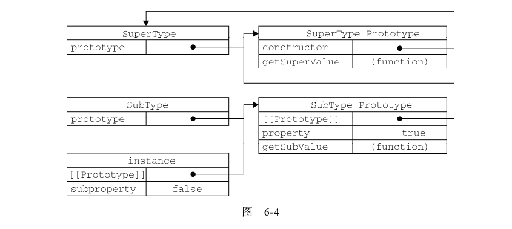
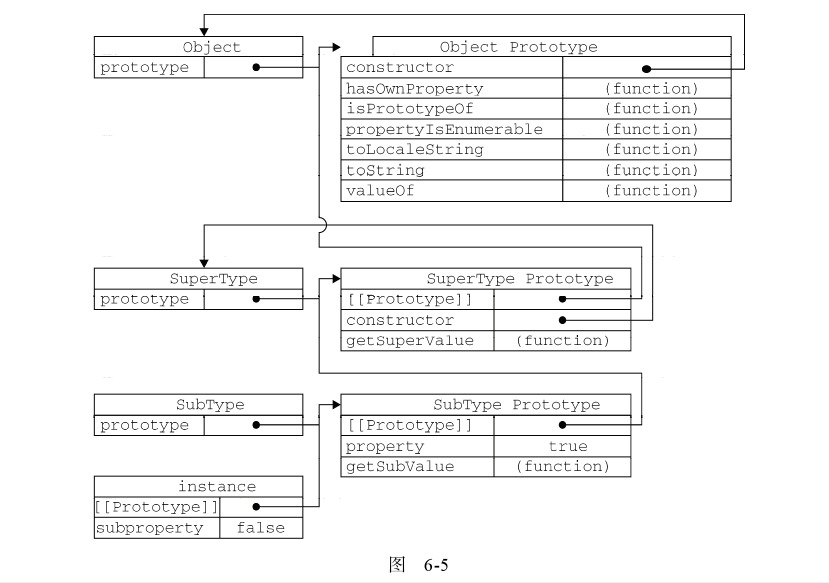

# 继承 

> 许多OO语言都支持两种继承方式（接口继承和实现继承）由于函数没有签名，在ECMAScript中无法实现接口继承，只支持实现继承。而实现继承主要是依靠原型链来实现。
+ 接口继承：只继承方法签名。
+ 实现继承：继承实际的方法。


构造函数、原型、实例三者之间的关系：
+ ***每个构造函数都有一个原型属性（指向原型对象的指针）***
+ ***每一个原型对象都有一个指向构造函数的属性***
+ ***每一个实例都有一个指向原型的内部指针***

##1. 原型链

> 原型链基本思想是利用原型让一个引用类型继承另外一个引用类型的属性和方法。

```javascript
function SuperType(){
  this.property = false;
}

SuperType.prototype.getProperty = function(){
  return this.property;
};

function SubType(){
  this.property = true;
}

//此时SubType 继承了SuperType
SubType.prototype = new SuperType();

var instance = new SubType();

```

原型继承关系图如下：


### 1.1 别忘记默认的原型

> 事实上，前面的原型连少了一环。我们都知道所有的引用类型都是继承自Object类型，而这个继承也是通过原型链实现的。***所有函数的默认原型都是Object的实例，默认原型都会包含一个内部指针，指向Object.prototype***。

完整原型连关系图如下：



###1.2 确定原型与实例之间的关系

> 可以通过两种方式来确认原型与实例之间的关系：
+ instanceOf 用来测试实例与原型链中出现过的构造函数，都会返回True
+ isPrototypeOf 测试原型链中出现过的原型，都会返回True

```javascript
console.log(instance instanceOf Object);
console.log(instance instanceOf SuperType);
console.log(instance instanceOf SubType);

console.log(Object.prototype.isPrototypeOf(instance));
console.log(SuperType.prototype.isPrototypeOf(instance));
console.log(SubType.prototype.isPrototypeOf(instance));
```

###1.3 谨慎的定义方法

> 添加原型属性、方法一定要放在替换原型语句之前，否则属性和方法都会失效。

```javascript
SubType.prototype.addType = function(){
  console.log('add type success');
};

//此句代码会导致上一句代码失效
SubType.prototype={
  type : 11,
  sayName : function(){
    console.log(this.type);
  }
};

```

***SubType.prototype替换后，addType方法会丢失***


###1.4 原型链的问题

> 原型链的问题，主要来自原型中，主要是两个问题：
+ 引用属性，一旦原型中存在引用类型的属性，所有的实例都会共享该属性。
+ 创建子类实例时，不能向超类构造函数中传入参数


