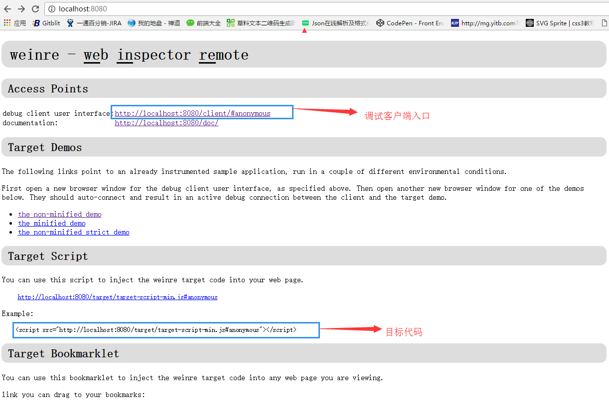
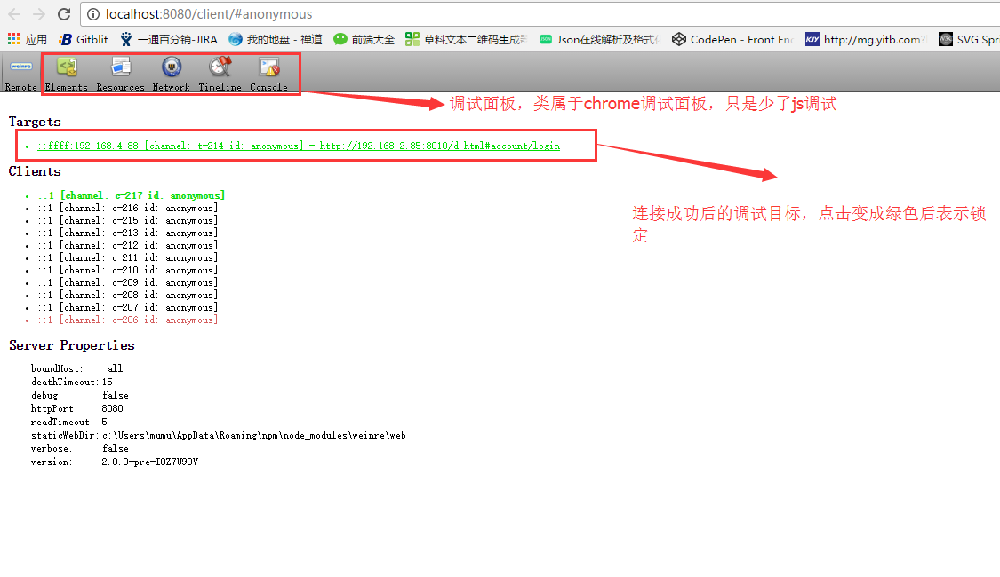

# weinre 远程web站点调试

## 简介

全称：Web Inspector Remote ,方便在移动浏览器内的web页面或应用，能够即时调试DOM元素、CSS元素、脚本错误、以及请求等

weinre调试时，存在三种元素：
+ 调试服务器，一般是以node启动的代理服务器
+ 调试客户端，一般是桌面chome浏览器内
+ 调试目标，一般是移动设备浏览器内页面

## 安装和运行

该工具依赖于node环境，使用node全局安装

```node
npm install -g weinre
```

安装好后，启动weinre代理服务器，启动参数如下：
+ --httpPort 表示调试客户端端口
+ --httpHost 表示调试客户端的ip
+ --verbose  
+ --debug
+ --readTimeout  等待目标消息限时
+ --deathTimeout 目标连接超时

```shell
weinre --httpPort=8080 --httpHost=127.0.0.1
weinre --httpPort=8080 --httpHost=-all-
```

## weinre使用

启动weinre代理服务器后，使用--httpPort和--httpHost组成url在Chrome打开调试客户端,例如上述案例中url如下：

```
http://127.0.0.1:8080
```

在服务器主页中，存在两项内容特别重要：
+ 远程调试入口URL
+ 目标代码，将该代码加入到调试的页面，也可以是书签的方式动态加入



进入调试客户端后，第一个tab标签remote，代表调试客户端与调试目标连接情况，可以刷新更新。




