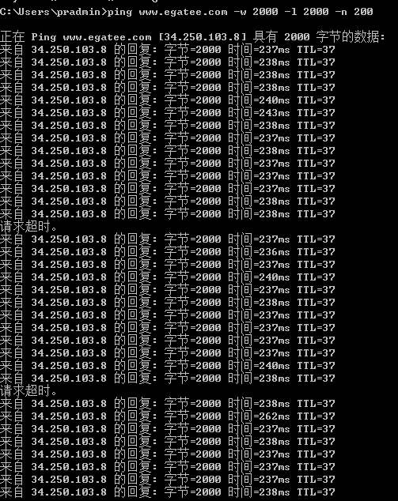
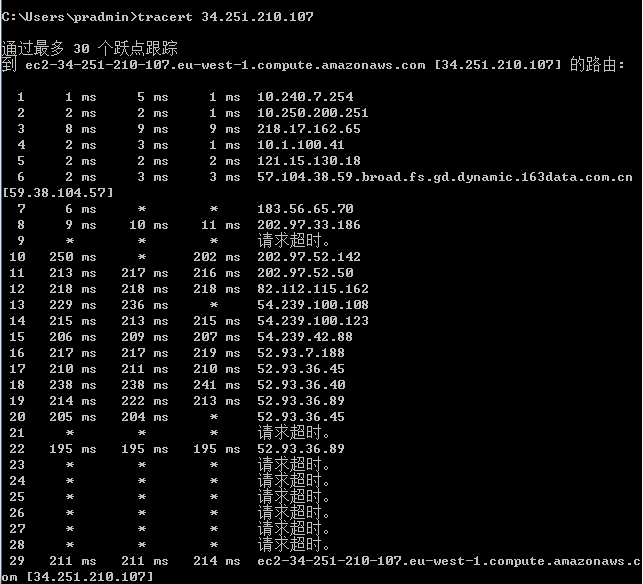

# 网站性能测试工具

## ping 工具

>ping ip
-a 自动解析ip所对应的域名
-w 表示超时时间，网络差就设置大一点，单位ms
-n 测试包数量，默认情况下发送4个
-l  表示数据包大小 默认为34byte

```
ping www.egatee.com -w 2000 -l 2000 -n 200
```

结果：



## tracert 跟踪路由

>用法: tracert [-d] [-h maximum_hops] [-j host-list] [-w timeout]
               [-R] [-S srcaddr] [-4] [-6] target_name
+ -d                 不将地址解析成主机名。
+ -h maximum_hops    搜索目标的最大跃点数。
+ -j host-list       与主机列表一起的松散源路由(仅适用于 IPv4)。
+ -w timeout         等待每个回复的超时时间(以毫秒为单位)。
+ -R                 跟踪往返行程路径(仅适用于 IPv6)。
+ -S srcaddr         要使用的源地址(仅适用于 IPv6)。
+ -4                 强制使用 IPv4。
+ -6                 强制使用 IPv6。

```
tracert bim.yiwill.com
```

执行结果：




## httping测试

>工具非常强大，很好的避免了ping被路由、防火墙、服务器屏蔽的一系列问题，一般在linux中都有开源库，具体看--help


```
yum install httping

httping www.baidu.com

```


