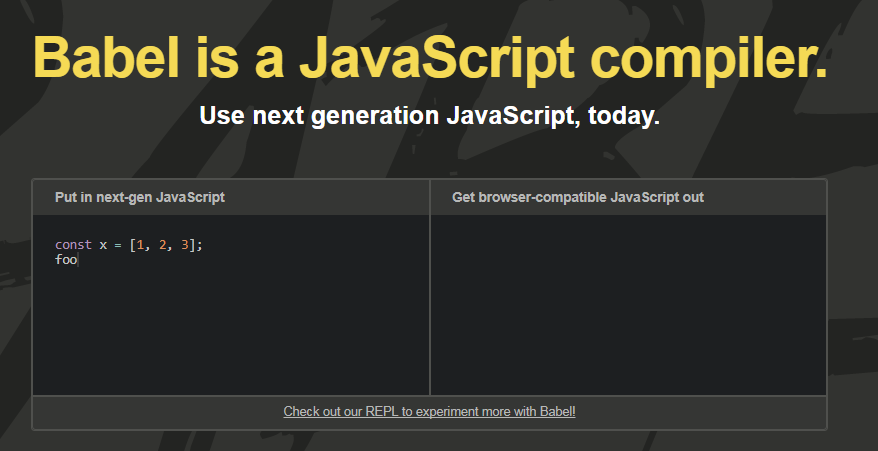
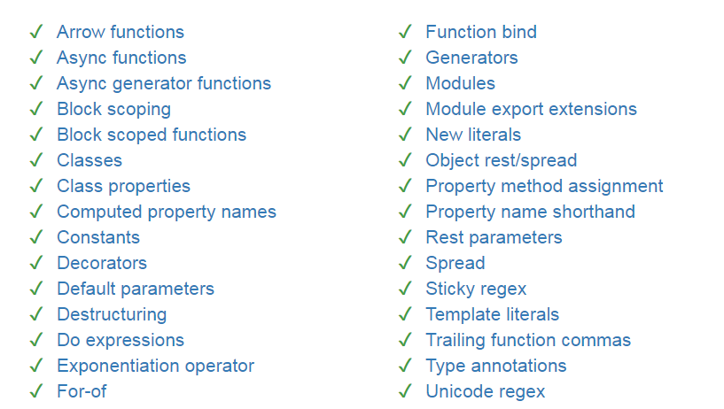

# Vue2前端技术生态
## 演讲者：LinQ
<br/>
+ Vue2核心基础
+ 组件系统（props、emit events、slot）
+ 扩展能力-插件
+ webpack模块捆绑器
+ babel/es6


# 一、Vue2核心基础
<br/>
+ Vue2实例生命周期
+ 模板及指令
+ 响应式属性-数据驱动（data、watch、computed）


# Vue2实例生命周期
<br/>

> 每个 Vue 实例在被创建之前都要经过一系列的初始化过程。例如需要设置数据监听、编译模板、挂载实例到 DOM、在数据变化时更新 DOM 等。同时在这个过程中也会运行一些叫做**生命周期钩子**的函数，给予用户机会在一些特定的场景下添加他们自己的代码

## Created
> 到该钩子执行，Vue实例已经完成：初始化事件、响应式data。

## mounted
> 到该钩子执行，Vue实例已经完成template模板编译、挂载到el跟节点。此时Vue的内容在html文档DOM树中


## updated
<br/>

> 执行该钩子，Vue实例中响应式数据（data、computed等）发生变化，更新VDom及重新渲染HTML 文档DOM

## destroyed
<br/>

> 执行该钩子，Vue实例被销毁（Watcher、components、event Listeners等均被销毁）

###**Remind**：
<br/>
>上述主要钩子中，每个钩子均存在一个before的钩子（beforeCreate、beforeMount、beforeUpdate、beforeDestroy）处理特殊场景


## 图谱
<br/>


# 模板及指令
<br/>

> Vue.js 使用了基于 HTML 的模板语法，允许开发者声明式地将 DOM 绑定至底层 Vue 实例的数据。所有 Vue.js 的模板都是合法的 HTML ，所以能被遵循规范的浏览器和 HTML 解析器解析。

在底层的实现上，Vue将模板编译成虚拟DOM渲染函数。结合响应系统，在应用状态改变时，Vue 能够智能地计算出重新渲染组件的最小代价并应用到 DOM 操作上。


## 文本
<br/>

```html
<span>Message: {{ msg }}</span>
```

## v-html 原始html
<br/>

```html
<div v-html="rawHtml"></div>
```


## v-bind或:简写


```html
<button :title="tips"></button>
<a v-bind:href="url"></a>
<div v-bind:class="{ active: isActive }"></div>
<div v-bind:style="{ color: activeColor, fontSize: fontSize + 'px' }"></div>
```
<br/>
## v-on或@简写
```html
<a @click="doSomething(username, $event)"></a>
<a @click="doSomething('first')"></a>
<a @click.prevent="doSomething('first')"></a>
```


## v-model
<br/>

```html
<input v-model="message" placeholder="edit me">
<input type="checkbox" id="checkbox" v-model="checked">
<input type="radio" id="one" value="One" v-model="picked">
<input type="radio" id="two" value="Two" v-model="picked">
<input v-model.number="age" type="number">
<input v-model.trim="msg">
```


## v-if/v-else/v-else-if
<br/>

```html
<h1 v-if="ok">Yes</h1>
<h1 v-else>No</h1>

<template v-if="ok">
<h1>Title</h1>
<p>Paragraph 1</p>
<p>Paragraph 2</p>
</template>
```


## v-show
<br/>

```html
<h1 v-show="ok">Hello!</h1>
```


## v-if vs v-show 区别
<br/>

+ v-if 懒惰，条件为真时才渲染，可以用来做**懒惰加载组件或弹窗**
+ v-show 只是相当于style='display:none'，**频繁渲染且变化不大的组件**


## v-if 与 v-for一起使用
<br/>

+ v-for有更高的优先级，处理它们是可以建议使用template

```html
<template v-if='list.length'>
<li v-for='item in list'>{{item}}</list>
</template>
```


# 响应式属性
<br/>

> Vue 的一个最明显的特性就是其不太引人注意的响应式系统。数据模型仅仅是普通的  对象。而当你修改它们时，视图会进行更新。当你把一个普通的  对象传给 Vue 实例的`data`选项，Vue 将遍历此对象所有的属性，并使用[Object.defineProperty](https://developer.mozilla.org/en-US/docs/Web//Reference/Global_Objects/Object/defineProperty)把这些属性全部转为 getter/setter。

+ data数据会被代理，拥有通知watcher的能力


## 实现原理
<br/>

> 每个组件实例都有相应的**watcher**实例对象，它会在组件渲染的过程中把属性记录为依赖，之后当依赖项的`setter`被调用时，会通知`watcher`重新计算，从而致使它关联的组件得以更新。

+ Data中数据相当发布者（publish）
+ 而VDom相当于watcher订阅者（subscribe）
+ VDom Listener事件订阅（input），更新Data数据
+ 用户输入，HTML节点发布事件


## computed
<br/>

> 模板内的表达式是非常便利的，但是它们实际上是用于简单运算的。在模板中放入太多的逻辑会让模板过重且难以维护，而且data中的属性都具有观察能力，性能和实现难度都会加大。

+ 同时观察多个响应式数据 {:&.fadeIn}
+ 缓存数据的能力


<br>
```javascript
var vm = new Vue({
        el: '#demo',
        data: {
        firstName: 'Foo',
        lastName: 'Bar'
    },
    computed: {
        fullName: function () {
            return this.firstName + ' ' + this.lastName
        }
    }
})
```


## watch

> Vue 确实提供了一种更通用的方式来观察和响应 Vue 实例上的数据变动：**watch 属性**。当你有一些数据需要随着其它数据变动而变动时

```javascript
var vm = new Vue({
        el: '#demo',
        data: {
        firstName: 'Foo',
        lastName: 'Bar',
        fullName: 'Foo Bar'
    },
    watch: {
        firstName: function (val) {
            this.fullName = val + ' ' + this.lastName
        },
        lastName: function (val) {
            this.fullName = this.firstName + ' ' + val
        }
    }
})
```


## Question：
<br/>

+ data一级属性什么时候定义,为什么？
+ watch可以监听那些属性 ,data中的二级属性能否监听？
+ data属性是响应式的，如果操作二级属性（数组、对象、简单数据类型）依然让它们具有响应的能力


# 二、组件系统
<br/>

- Vue组件设计
- 作用域插槽
- 单文件组件
- 异步组件


# Vue组件设计
<br/>

> 组件 (Component) 是 Vue.js 最强大的功能之一。组件可以扩展 HTML 元素，封装可重用的代码。在较高层面上，组件是自定义元素，Vue.js 的编译器为它添加特殊功能.

+ 拓展html标签  {:&.fadeIn}
+ 组件资源独立（js/css/html等资源完全独立）
+ 单向数据流，派发事件解耦
+ 支持slot插槽及作用域数据，个性化定制接口


# 全局组件定义
<br>
要注册一个全局组件，你可以使用 Vue.component(tagName, options)。例如：

```html
<div id="example">
  <my-component :orderId='orderid' @myClick='handle'></my-component>
</div>
```


```javascript
Vue.component('my-component', {
  template:'<div @click="clickHandle">{{}}-{{}}</div>'
  data(){
    return {
        myPrivateProperty:1
    }
  },
  props:{
    orderId:{
        type:Number,
        required:true
    }
  },
  methods:{
    clickHandle(){
        this.$emit('myClick')
    }
  }
})
```


# 局部组件定义
<br>
不必在全局注册每个组件。通过使用组件实例选项注册，可以使组件仅在另一个实例/组件的作用域中可用：

```javascript
var Child = {
  template: '<div>A custom component!</div>',
  props:{
    childType:{
        type:String
        default:''
    }
  }
}
new Vue({
    components: {
    // <my-component> 将只在父模板可用
    'my-component': Child
  }
})
```


## 可复用组件三要素
<br/>

+ Props 允许外部环境传递数据给组件，父容器与子组件交互 
+ Events 允许从外部环境在组件内触发副作用，子组件与父容器交互
+ Slots 允许外部环境将额外的内容组合在组件中。

```html
<my-component
  :foo="baz"
  :bar="qux"
  @event-a="doThis"
  @event-b="doThat"
>
  
  <p slot="main-text">Hello!</p>
</my-component>
```


## props

+ 支持数据类型
+ 支持数据验证Validation
+ 支持默认值，必填值
+ 单项数据流，props属性不允许在内部改变


```javascript
Vue.component('example', {
  props: {
    // 必传且是字符串
    propC: {
      type: String,
      required: true
    },
    // 数字，有默认值
    propD: {
      type: Number,
      default: 100
    },
    propE: {
      type: Boolean,
      default: true
    },
    // 自定义验证函数
    propF: {
      validator: function (value) {
        return value > 10
      }
    }
  }
})
```


## Question
<br/>

+ 单向数据流不允许直接修改Props，如果子组件需要改变父容器的值，应该怎么处理？


## .sync 修饰符
<br/>

>从 2.3.0 起我们重新引入了 .sync 修饰符，但是这次它只是作为一个编译时的语法糖存在。它会被扩展为一个自动更新父组件属性的 v-on 侦听器。

```html
<comp :foo.sync="bar"></comp>
```


<br/>

编译后自动被拓展为：

```html
<comp :foo="bar" @update:foo="val => bar = val"></comp>
```

当子组件需要更新 foo 的值时，它需要显式地触发一个更新事件：

```javascript
this.$emit('update:foo', newValue)
```


## slots
<br/>

>为了让组件可以组合，我们需要一种方式来混合父组件的内容与子组件自己的模板。这个过程被称为内容分发 (或“transclusion”如果你熟悉 Angular)。Vue.js实现了一个内容分发 API，参照了当前 Web 组件规范草案，使用特殊的 <slot> 元素作为原始内容的插槽。


假定子组件模板为：

```html
<div class="container">
  <header>
    <slot name="header"></slot>
  </header>
  <main>
    <slot></slot>
  </main>
  <footer>
    <slot name="footer"></slot>
  </footer>
</div>
```


<br>
父组件模板：

```html
<app-layout>
  <h1 slot="header">这里可能是一个页面标题</h1>
  <p>主要内容的一个段落。</p>
  <p>另一个主要段落。</p>
  <p slot="footer">这里有一些联系信息</p>
</app-layout>
```


<br>
渲染结果：

```html
<div class="container">
  <header>
    <h1>这里可能是一个页面标题</h1>
  </header>
  <main>
    <p>主要内容的一个段落。</p>
    <p>另一个主要段落。</p>
  </main>
  <footer>
    <p>这里有一些联系信息</p>
  </footer>
</div>

```


# 作用域插槽

>作用域插槽是一种特殊类型的插槽，用作一个替换已渲染元素的 (能被传递数据的) 可重用模板。将数据传递给插槽内模板

```html
<div class="parent">
  <my-component>
    <template scope="props">
      <span>hello from parent</span>
      <span>{{ props.text }}</span>
    </template>
  </my-component>
</div>
```

在父级中具有特殊属性scope的template存在，允许scope的值定义临时变量名，此变量从子组件中传递props对象


假定子组件内容为：

```html
<div class="child">
  <slot v-for='item in list'></slot>
</div>
```
渲染结果：

```html
<div class="parent">
  <div class="child">
    <span>hello from parent</span>
    <span>11111</span>
    <span>hello from parent</span>
    <span>11111</span>
  </div>
</div>
```


#单文件组件 

> 在现代 UI 开发中，我们已经发现相比于把代码库分离成三个大的层次并将其相互交织起来，把它们划分为松散耦合的组件再将其组合起来更合理一些。在一个组件里，其模板、逻辑和样式是内部耦合的，并且把他们搭配在一起实际上使得组件更加内聚且更可维护

+ 模板
+ 逻辑
+ 资源样式


## 使用单文件组件的优势

+ 字符串模板高亮
+ css预处理器（less、sass）
+ javascript预处理构建
+ 组件更加独立，不依赖外部资源加载


# 异步组件
<br>

>在大型应用中，我们可能需要将应用拆分为多个小模块，按需从服务器下载。为了让事情更简单，Vue.js 允许将组件定义为一个工厂函数，动态地解析组件的定义。Vue.js 只在组件需要渲染时触发工厂函数，并且把结果缓存起来，用于后面的再次渲染。

+ 定义组件工厂函数
+ 支持返回promise或resolve解析异步函数


```javascript
Vue.component('async-example', function (resolve, reject) {
 // 这个特殊的 require 语法告诉 webpack
  // 自动将编译后的代码分割成不同的块，
  // 这些块将通过 Ajax 请求自动下载。
  require(['./my-async-component'], resolve)
})
```

<br>

```javascript
Vue.component('async-webpack-example', ()=>import('./my-async-component'))
```


<br>
+ 异步组件优势? 


# 三、插件系统
<br>

>插件通常会为 Vue 添加全局功能。插件的范围没有限制

<br>
+ 添加全局方法或者属性 {:&.moveIn}
+ 添加全局资源：指令/过滤器/过渡等，如 vue-touch
+ 通过全局 mixin 方法添加一些组件选项，如: vue-router
+ 添加 Vue 实例方法，通过把它们添加到 Vue.prototype 上实现
+ 实现库，vue-router


## 定义插件
<br>
>Vue.js 的插件应当有一个公开方法 install 。这个方法的第一个参数是 Vue 构造器，第二个参数是一个可选的选项对象

+ install 函数
+ 载入vue构造器和可选参数


<br>
```javascript
MyPlugin.install = function (Vue, options) {
  Vue.myGlobalMethod = function () {}
  // 2. 添加全局资源
  Vue.directive('my-directive', {
    bind (el, binding, vnode, oldVnode) {
    }
    ...
  })
  // 3. 注入组件
  Vue.mixin({
    created: function () {
    }
  })
  Vue.prototype.$myMethod = function (methodOptions) {
    // 逻辑...
  }
}
```


## 使用插件
<br>
通过全局方法 Vue.use() 使用插件：

```javascript
// 调用 `MyPlugin.install(Vue)`
Vue.use(MyPlugin)
```


<br>
也可以传入一个选项对象：

```javascript
Vue.use(MyPlugin, { someOption: true })
```

<br>

Vue.use 会自动阻止注册相同插件多次，届时只会注册一次该插件


# 官方插件
<br>
+ vue-router 实现SPA单页路由
    + SPA具有前端路由，url和入口控制性增强
    + 可做功能切换节流，可做懒加载（结合Webpack和Vue的异步组件能力）
    + 允许定制转场动画、逻辑等，改进用户体验 
+ vuex 状态管理模式，解决组件与组件之间通讯
    + 包含state、mutation、actions等主要部分
    + 全局状态管理，多组件共享
    + 响应式状态，state变化View绑定VDom节点变化

Tips: Vuex 经常使用铁四角[store.state、store.mutation、组件computed、页面模板绑定]


# 四、Webpack 模块捆绑器
<br>


# 介绍
<br>

+ 优势
+ loaders和plugins等常规配置
+ code spliing 代码分割懒加载


# 优势
<br>
+ 解决模块依赖，模块预处理
+ 支持多语言编写前端代码
    + js（es6、typescript等）
    + css(less、sass等)
    + html(jade、ejs、vue模板等) 
+ 兼容Commonjs、AMD、ES6等模块处理器写法
+ Tree Shaking功能删除未被使用的代码，减少体系
+ code Splitting及懒惰加载，做到按需/懒惰加载
+ hot module development热替换，自动刷新和增量构建


# loaders和plugins配置

+ entry 入口
+ output 输出配置
+ loaders 模板预处理器
+ plugins 插件
+ externals 全局变量配置
+ resolve 模块解析规则


## loaders
<br>
所有的loaders均配置与rules规则中，loaders分类：
+ pre 所有loader执行之前执行
+ normal 正常执行
+ post   所有loader执行之后执行


## 核心配置项
<br>
+ test  正则匹配需要处理的module
+ loader  采用的loader名字，一般是-loader结尾
+ include 指定包含的文件或目录
+ exclude 排除的文件或目录


<br>

```javascript
{
    module: {
        rules: [{
                test: /\.vue$/,
                loader: 'vue-loader'
                }, 
                {
                test: /\.js$/,
                loader: 'babel-loader',
                include: projectRoot,
                exclude: /node_modules/
            }]
        }
}
```


# code Spliting代码分割
<br>

+ CommonsChunkPlugin 提取公用代码，
    + 一般代码被引用超过一次就可以抽取common vender中
    + 在plugins中加入new webpack.optimize.CommonsChunkPlugin()即可
+ Dynamic Imports，使用下列语法是，会独立抽取一个包，并进行按需懒惰加载
    + require([depts], factory(){}) AMD写法
    + require.ensure([],function(){})  CommonJS语法
    + import ES6+ Stage-3语法
    + async-await语法，ES2017标准


<br>

## AMD 写法
<br>

AMD也采用require()语句加载模块，但是不同于CommonJS，它要求两个参数：
+ 第一个参数[module]，是一个数组,里面的成员就是要加载的模块
+ 第二个参数callback，则是加载成功之后的回调函数
```javascript
　　require([module], callback);
```


实例：
<br>
```javascript
require(['math'], function (math) {
　　math.add(2, 3);
});
```


## CommonJS 语法
<br>
语法如下：
```javascript
require.ensure(dependencies: String[], callback: function(require), chunkName: String)
```


实例：
<br>
```javascript
require.ensure([], function (require) {
　　var math = require('math')
    math.add(2,3)
});
```


## import 
<br>

语法:

```javascript
//返回promise对象，支持then和catch功能
import(path)

```


<br>
实例：

```javascript

 function getComponent() {
   var element = document.createElement('div');
   return import(/* webpackChunkName: "lodash" */ 'lodash').then(_ => {
     var element = document.createElement('div');

     element.innerHTML = _.join(['Hello', 'webpack'], ' ');

     return element;

   }).catch(error => 'An error occurred while loading the component');
  }
 getComponent().then(component => {
   document.body.appendChild(component);
 })

```


## async-await
<br>
+ async 修饰函数定义，具有标识的颜色允许使用await
+ await 修饰函数调用

```javascript
async function getComponent() {
   var element = document.createElement('div');
   const _ = await import(/* webpackChunkName: "lodash" */ 'lodash');
   element.innerHTML = _.join(['Hello', 'webpack'], ' ');
   return element;
}
```


# tree Shaking
<br>
实现条件：
+ Webpack2+ 支持ES2015模块加载器，通过JS语法树能够分析出dead-code(未被使用代码)
    + import
    + export 
+ UglifyJSPlugin 能够删除未被使用代码


math.js代码如下：
<br>
```javascipt
export function square(x) {
  return x * x;
}

export function cube(x) {
  return x * x * x;
}
```


index.js代码如下：
```javascript
 import { cube } from './math.js';

  function component() {
   var element = document.createElement('pre');
   element.innerHTML = [
     'Hello webpack!',
     '5 cubed is equal to ' + cube(5)
   ].join('\n\n');

    return element;
  }
```
打包结果：cube被打包到bundle.js中，而square被踢出。


# 五、babel/es6
<br>



# babel介绍
<br>
+ es2015/2016/2017/stage-2介绍
+ presets 转换语法
+ plugins或polyfill对Api进行处理


## ES标准介绍
<br>
+ ES6/ES2015 
+ ES2016
+ ES2017
+ Stage-0到Stage-4
    + stage-0 想法
    + stage-1 提议
    + stage-2 草案
    + stage-3 实践
    + stage-4 完成


## presets

> presets对es6+语法进行转换



[compat-table 兼容语法查看表](https://kangax.github.io/compat-table/es6/)


<br>
babel-presets-env能够支持所有es2015+版本

```json
// .babelrc
{
  "presets": [
    ["env", {
      "targets": {
        "browsers": ["last 2 versions", "safari >= 7"]
      }
    }]
  ]
}
```


## polyfill

>对于ES6 中原生对象或API，需要添加polyfill才可以降级


babel-plugins-transform-runtime插件，支持原生对象，但不支持原生API，按需引入 
```json
{
  "presets": [
    ["env", {
      "modules": false,
      "targets": {
        "browsers": ["> 1%", "last 2 versions", "not ie <= 8"]
      }
    }],
    "stage-2"
  ],
  "plugins": ["transform-runtime"],
}

```


# 谢谢大家！