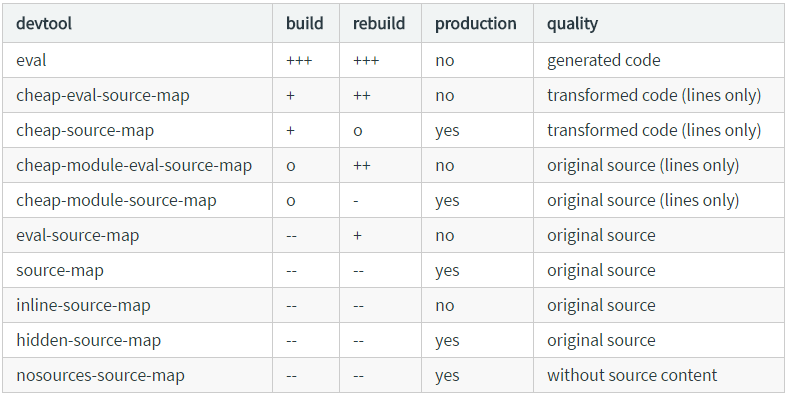

# vue framework

## vue

## vue-router

## babel-es6


## webpack

### entry

### output

### module

> 那些模块类型能被处理，怎么处理；代码中使用require、import、define等模块加载器的方法调用

#### noParse

> Type：RegExp | [RegExp] | function

> 含义：表示被加载器忽略的文件或语句

### rules

> Type Array(Rule)
> 模块被怎么加载的规则集

### Rule

> 模块加载器规则：
+ Conditions包含resource和issuer两部分
    + resource部分包含(test,include,exclude,resource属性)
    + issuer 部分包含（issuer属性）
+ Results 在conditions匹配后应用于输出结果
    + Applied Loaders: 处理资源的loaders（use、loader、loaders/ options、query、）
    + Parser Options: module解析器的选项（parser）
+ Nested Rules 内嵌规则

###  常用属性
+ Rule.enforce
+ Rule.exclude
+ Rule.include
+ Rule.issuer
+ Rule.loader 指定loader
+ Rule.use/Rule.loaders（兼容） 批量loaders
+ Rule.options/Rule.query（兼容）  指定loader的options
+ Rule.oneOf
+ Rule.parser 当前loaders的解释器配置
+ Rule.test

[loaders列表](https://webpack.js.org/loaders/source-map-loader/)

## resolve

> 改变模块如何被处理的规则；默认情况下Module Resolution具有默认的处理规则。而使用resolve选项能够改变Module默认的处理规则

### resolve.alias

配置资源或模块路径的别名

```javascript
alias: {
  Utilities: path.resolve(__dirname, 'src/utilities/'),
  Templates: path.resolve(__dirname, 'src/templates/')
}
```
在使用时，可以简化

```javascript
import Utility from '../../utilities/utility';
import Utility from 'Utilities/utility';
```


表格展示：

|  alias:            |  import "xyz"                | import "xyz/file.js"    |
| ------------------ | ---------------------------- | ----------------------- |
| {}                  | /abc/node_modules/xyz/index.js | /abc/node_modules/xyz/file.js    |
| { xyz: "/abs/path/to/file.js" } | /abs/path/to/file.js | error                          |
| { xyz$: "/abs/path/to/file.js" } | /abs/path/to/file.js | /abc/node_modules/xyz/file.js |
| { xyz: "./dir/file.js" }        | ./dir/file.js         | error                         |
| { xyz$: "./dir/file.js" }       | ./dir/file.js         | /abc/node_modules/xyz/file.js |
| { xyz: "/some/dir" }            | /some/dir/index.js    | /some/dir/file.js             |
| { xyz$: "/some/dir" }           | /some/dir/index.js    | /abc/node_modules/xyz/file.js |
| { xyz: "./dir" }                | ./dir/index.js        | ./dir/file.js                 |
| { xyz: "modu" }                 | /abc/node_modules/modu/index.js | /abc/node_modules/modu/file.js |
| { xyz$: "modu" }                | /abc/node_modules/modu/index.js | /abc/node_modules/xyz/file.js  |
| { xyz: "modu/some/file.js" }    | /abc/node_modules/modu/some/file.js  | error                     |
| { xyz: "modu/dir" }             | /abc/node_modules/modu/dir/index.js  | /abc/node_modules/modu/dir/file.js |
| { xyz: "xyz/dir" }              | /abc/node_modules/xyz/dir/index.js   | /abc/node_modules/xyz/dir/file.js  |
| { xyz$: "xyz/dir" }             | /abc/node_modules/xyz/dir/index.js   | /abc/node_modules/xyz/file.js      |


### resolve.enforceExtension

> 是否允许后缀名缺省  extension-less file

### resolve.enforceModuleExtension

Boolean

> 匿名模块，指module上面的loader之类的拓展名

### resolve.extensions

> 重载默认的后缀名称

```javascript
extensions: [".js", ".json"]
```
### resolve.mainFiles

```javascript
mainFiles: ["index"]
```

### resolve.modules
Array

> 哪些指定目录会被搜索

### resolve.plugins

Array

> 插件对象数组

```javascript
plugins: [new DirectoryNamedWebpackPlugin()]
```

### resolveLoader.moduleExtensions

Array

> 解析模块的默认拓展名

```javascript
moduleExtensions: ['-loader']
```

## plugins

Array

```javascript

var webpack = require('webpack')
// importing plugins that do not come by default in webpack
var ExtractTextPlugin = require('extract-text-webpack-plugin');
var DashboardPlugin = require('webpack-dashboard/plugin');

// adding plugins to your configuration
plugins: [
  // build optimization plugins
  new webpack.optimize.CommonsChunkPlugin({
    name: 'vendor',
    filename: 'vendor-[hash].min.js',
  }),
  new webpack.optimize.UglifyJsPlugin({
    compress: {
      warnings: false,
      drop_console: false,
    }
  }),
  new ExtractTextPlugin({
    filename: 'build.min.css',
    allChunks: true,
  }),
  new webpack.IgnorePlugin(/^\.\/locale$/, /moment$/),
  // compile time plugins
  new webpack.DefinePlugin({
    'process.env.NODE_ENV': '"production"',
  }),
  // webpack-dev-server enhancement plugins
  new DashboardPlugin(),
  new webpack.HotModuleReplacementPlugin(),
]
```

[插件列表](https://webpack.js.org/plugins/source-map-dev-tool-plugin/)

## DevServer

> webpack-dev-server 帮助快速开发

### devServer.allowedHosts

> 允许访问server主机
Array
```javascript
// this achieves the same effect as the first example
// with the bonus of not having to update your config
// if new subdomains need to access the dev server
allowedHosts: [
    '.host.com',
    'host2.com'
]
```

### devServer.clientLoglevel
string

> 服务器启动消息类型

取值： none, error, warning , info

### devServer.compress

Boolean

> 是否开启gzip压缩

### devServer.contentBase

Array String Boolean

> server 服务的目录（站点的目录），默认为当前目录.

```javascript
contentBase: path.join(__dirname, "public")
contentBase: [path.join(__dirname, "public"), path.join(__dirname, "assets")]
contentBase: false
```

### devServer.headers
Object
> 新增响应头

```javascript
headers: {
  "X-Custom-Foo": "bar",
  "Access-Control-Allow-Origin":"*"
}
```
### devServer.historyApiFallback

Object Boolean

> 对H5 history API等浏览历史进行处理


### devServer.host

String

>  默认为localhost，允许调整为任意host

```
host: '0.0.0.0'
```

### devServer.hot

Boolean

> 开启webpack Hot Module Replacement 的功能--模块热替换

```javascript
hot: true
```
### devServer.https

Boolean Object

```javascript
//http/2 with https
https:true

https: {
  key: fs.readFileSync("/path/to/server.key"),
  cert: fs.readFileSync("/path/to/server.crt"),
  ca: fs.readFileSync("/path/to/ca.pem"),
}

```

### devServer.inline
Boolean

> 切换dev server 两种不同的模式（inline和iframe）。默认为inline（script将被插入到bundle和重新reload）

```javascript
inline: false
```

### devServer.noInfo
Boolean

> 消息开关，为false将会关闭所有的提示消息

### devServer.watchContentBase
Boolean

> watch站点目录，内容改变时自动reload

### devServer.watchOptions

Object

```javascript
watchOptions: {
  poll: true
}

```

[参考教程](https://webpack.js.org/configuration/module/)

## vue-devtool

### devtool
String false

> 配置debugger时的源码映射风格



### development

+ eval
+ inline-source-map
+ eval-source-map
+ cheap-eval-source-map
+ cheap-module-eval-source-map

### production

+ source-map
+ hidden-source-map
+ cheap-source-map
+ cheap-module-source-map
+ nosources-source-map

[参考教程](https://segmentfault.com/a/1190000009682735)

## externals

String Array Object Function Regex

> 从output bundles的依赖中排出资源，不会打包到bundle中去。相反这些资源是依赖于当前运行的环境

index.html

```html
<script src="https://code.jquery.com/jquery-3.1.0.js"
  integrity="sha256-slogkvB1K3VOkzAI8QITxV3VzpOnkeNVsKvtkYLMjfk="
  crossorigin="anonymous"></script>
```

webpack.config.js

```javascript
externals: {
  jquery: 'jQuery'
}
```

This leaves any dependent modules unchanged, i.e. the code shown below will still work:

```javascript
import $ from 'jquery';

$('.my-element').animate(...);
```

externals library使用有几种形式：
+ global 全局变量引入
+ commonjs
+ commonjs2
+ amd

